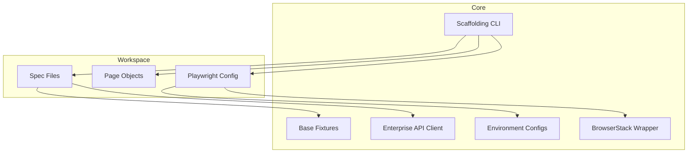

<div align="center">
  
  <h1>@hari/playwright-core</h1>
  <p>
    <strong>Enterprise-grade Playwright Platform Framework</strong>
  </p>
  <p>
    
    
    
    
  </p>
</div>

---

> **`@hari/playwright-core`** is a centralized, modular test automation framework built on top of [Playwright](https://playwright.dev/). It provides enterprise-grade abstractions, reusable base fixtures, an intuitive API client, and a powerful CLI tool to consistently scaffold new testing projects.

## ✨ Framework Features

| Feature | Description |
| --- | --- |
| 🚀 **Instant Scaffolding** | Generate complete, standardized testing projects using our built-in CLI within seconds. |
| 🔄 **Multi-Runner Support** | Seamlessly switch between Native Playwright, `playwright-bdd`, and `@cucumber/cucumber`. |
| 🏗️ **Strict POM Patterns** | Scaffolded templates enforce strict Page Object Model (POM) patterns for both UI and API tests. |
| 🌐 **Core Utility Exports** | Reusable API clients, dynamic environment configs, and pre-built base fixtures right out of the box. |
| ☁️ **Cloud Execution** | Natively wraps your config for zero-friction scaling to BrowserStack. |

---

## 🏛️ Architecture Overview

The framework provides a common base for all enterprise test automation. Project teams use the CLI to generate a standardized workspace, which inherits utilities from the core package.



---

## 📦 Installation

To use the core utilities in your existing project, install the package via npm:

```bash
npm install @hari/playwright-core
```

*(Ensure you have its peer dependencies `@playwright/test` and `typescript` installed).*

---

## 🛠️ Creating a New Project (Scaffolding)

Use the `init` command to scaffold a complete directory structure, configuration files, and sample POM tests customized to your project name.

### Step 1: Initialize

Run the CLI via `npx` in an empty directory:

```bash
npx @hari/playwright-core init --name <your-project-name>
```

### Step 2: Choose Your Template

Our CLI supports dynamic template injection based on your preferred testing paradigm. 

#### Option A: Native Playwright (Non-BDD)
Standard Playwright spec files (`.spec.ts`).
```bash
npx @hari/playwright-core init --name ui-regression --type non-bdd
```

#### Option B: Playwright BDD (Recommended for BDD)
Uses `playwright-bdd` which natively compiles Gherkin to Playwright specs.
```bash
npx @hari/playwright-core init --name bdd-e2e --type bdd --runner playwright-bdd
```

#### Option C: Cucumber BDD
Uses traditional `@cucumber/cucumber` integration.
```bash
npx @hari/playwright-core init --name cucumber-e2e --type bdd --runner cucumber
```

### Step 3: Install & Run

After scaffolding, the CLI handles the heavy lifting. All you need to do is:
1. **Install dependencies**: `npm install`
2. **Setup config**: `cp .env.example .env`
3. **Execute tests**: `npm run test`

---

## 🧠 Core Modules Guide

If you are extending the framework or building tests manually, import core utilities directly:

```typescript
import { 
  test,
  expect,
  ApiClient, 
  envConfig,
  withBrowserStack,
  withRunConfig
} from '@hari/playwright-core';
```

### 1. Enterprise `test` Fixture
We provide an extended `test` fixture that automatically injects `envConfig` and an initialized `apiClient` with proper typings for IntelliSense.

```typescript
import { test, expect } from '@hari/playwright-core';

test('verify user profile API', async ({ apiClient, envConfig }) => {
  const response = await apiClient.get('/api/v1/profile');
  expect(response.status()).toBe(200);
  
  const data = await response.json();
  console.log(`Running in environment: ${envConfig.env}`);
});
```

### 2. Environment Configuration (`envConfig`)
A strongly-typed configuration module that parses your `.env` files and securely exposes environment variables (URLs, credentials). Use this to eliminate hardcoded values and improve IntelliSense autocompletion for environment tokens.

### 3. Smart Test Runner Wrapper (`withRunConfig`)
Override Playwright defaults dynamically using `runconfig.json`.

```typescript
import { defineConfig } from '@playwright/test';
import { withRunConfig } from '@hari/playwright-core';

const baseConfig = defineConfig({
  testDir: './tests',
});

// Auto-loads runconfig.json and .env
export default withRunConfig(baseConfig, __dirname);
```

### 4. Cloud Execution (`withBrowserStack`)
Opt-in BrowserStack wrapper that injects capabilities effortlessly.

```bash
# Run tests on BrowserStack without changing code
USE_BROWSERSTACK=true BROWSERSTACK_USERNAME=myUser BROWSERSTACK_ACCESS_KEY=key npm test
```

---

## 📊 Enterprise Allure Reporting

The framework is natively integrated with **Allure Reporting**, completely rewritten using the latest Allure 3 Node.js CLI (meaning **Zero Java Dependency**).

### Zero-Config Core Features
When you scaffold a new project, reporting is fully configured out-of-the-box:
- **Environment Widget Auto-Generation**: The core automatically detects your OS, Node version, Playwright workers, and `testEnv`, and builds the `environment.properties` file for the dashboard widget!
- **Automatic API Logging**: The `ApiClient` seamlessly intercepts every request and response, parses the payloads, and attaches them as formatted JSON to your Allure report automatically.
- **Visual Diagnostics**: Trace files, videos, and screenshots are configured to automatically attach to the report on failure.

### Generating & Viewing Reports
The core scaffolding generates NPM scripts allowing you to serve a web dashboard or generate a standalone file for sharing via Slack/Email:

```bash
# Serve the dashboard locally
npm run report:open

# Generate a single standalone index.html file
npm run report:download
```

---

<div align="center">
  <i>Built for scale. Maintained with ❤️ by hari.</i>
</div>
